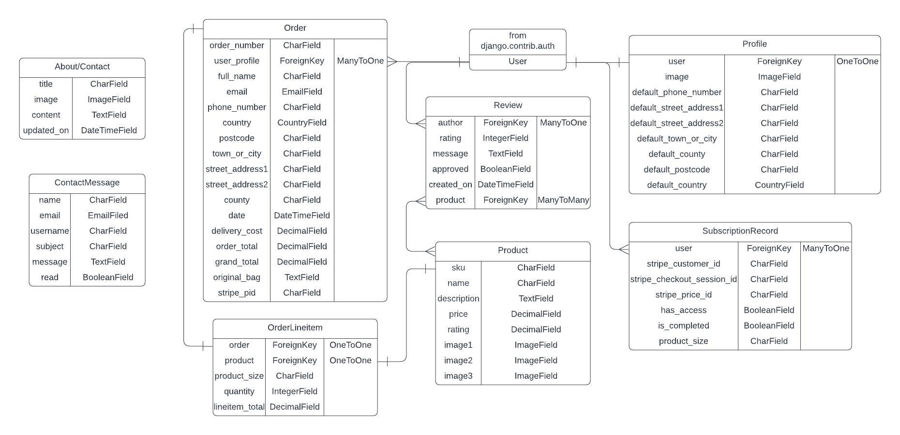

# Fun Socks Box

Fun Socks Box is a B2C (business to customer) e-commerce site that focuses primarily on a monthly subscription service delivering a box of three unique socks each month to subscribed registered customers. There is also an option for any customer to purchase the socks individually, though this is more expensive per sock than the monthly subscription cost, plus free delivery is only available for 3 socks or more. 

According to the online e-commerce platform Shopify in their blog article titled ‘20 Trending Products and Things to Sell Online (2024)’ found [here](https://www.shopify.com/uk/blog/trending-products?term=&adid=595096101745&campaignid=17075828612&utm_medium=cpc&utm_source=google&gad_source=1&gclid=EAIaIQobChMInsKR2qKfiQMV36BaBR2QEi4gEAAYASAAEgKmivD_BwE&cmadid=516586848;cmadvertiserid=10730501;cmcampaignid=26990768;cmplacementid=324286430;cmcreativeid=163722649;cmsiteid=5500011#10), listing the top 20 trending products sold by US Shopify merchants, socks are simple yet profitable choice for e-commerce brands. It also states that socks are a popular choice for subscription boxes.

[Link to the live website](https://mwbark-funsocksbox-6de564e8a4a8.herokuapp.com/)

## Planning

<details>

<summary>The Database Schema used for this project</summary>


</details>
<BR>
<details>

<summary>Wireframes</summary>

<br>

[Desktop Wireframes pdf](documentation/wireframes-desktop.pdf)
</details>

### Agile Methodology

Github Issues were used to create User Stories to plan actions to take in the project. Issues contained acceptance criteria to guide me in creating features and knowing when they were completed.

5 issues from the back catalog, with MoSCoW 'must have' ranking or highest available, were then put into a sprint/milestone to create a project iteration. Within the sprint, 3 issues (60%) were labeled 'must have' while the other 2 were labeled 'should have' or 'could have'.

The issues from the sprint were then added to a 'Fun Socks Box' Project board 'Todo' column. Issues were then, by priority, moved to the 'In Progress' and then 'Done' coloumn on completion. Any issues not completed before the sprint/iteration deadline were added back to the back catalog for reprioritisation.

## Features

### Existing features

**Header & Navigation**

- Site name and logo redirects to home page.

- ‘Subscribe’ and ‘Products’ link to related pages.

- On smaller screen sizes ‘Home’, ‘Subscribe’ and ‘Products’ are contained in a dropdown from a burger button.

- ‘My Account’ triggers a dropdown where users who haven't logged in can navigate to login and signup pages and logged in users can navigate to their ‘Address Book’ page, a logout page and a portal to Stripe to manage their subscription if they have one.

- The bag icon links to the bag page and the price icon shows the grand total of the user’s current bag.

- A banner alerts the user to the free delivery threshold.

**Home**

- An opaque card contains a description with site keywords relating to socks subscription box. A button links to the subscription page.

- Another card contains the call to sign up to the site’s newsletter via Intuit Mailchimp.

**Subscription**

- A card contains pricing and details relating to the monthly subscription box as well as a link to Stripe to subscribe.

**Products**

- Cards show images and names of this month's socks products and link to related sock product when clicked.

- Admin can see buttons to delete individual products and an ‘Add Product’ button to add a product.

**Product Detail**

- Slideshow of all related product images.

- Name, description and price of product.

- Buttons to select size any quantity when added to bag.

- Buttons to 'Add to Bag' and 'Keep Shopping'.

- Admin can 'Manage Images' and 'Update Product'.

**Add/Update Product**

- Contains a form with name, description and price to be filled in. This will be prefilled with the relevant product details if its ‘Update Product’.

- ‘Cancel’ button returns to product page. If the form is valid, Update/Add product buttons do as their names suggest, redirecting to the relevant pages with a success toast.

**Product Images**

- 'Add Image' and '-' buttons on the images allow admin to add and delete images via a model. 

**Bag**

- All products and product info in the bag is shown.

- The quantity of a product can be altered with the + and – buttons. Clicking ‘Update’ will update the product quantity and ‘Delete’ will remove the product from the bag.

- All pricing including bag total, delivery, grand total and a free delivery threshold is shown.

- A 'Checkout' button takes the user to the checkout page while a 'Keep Shopping' button takes the user back to the products.

**Checkout**

- Contains a form where users can fill in their name, email, delivery details and card details for payment. Registered users with a default address will have the required details (apart from card) prefilled.

- An order summary is shown on the right.

- Unregistered users have a link to the sign-up page if they want to create a default address. Registered users will have a link to their address book to change or create one.

- An ‘Adjust Bag’ button links the user back to their bag, while the ‘Complete Order’ button takes the user to the checkout success page if the form has been filled in correctly.

**Checkout Success**

- Page shows all the order, delivery and billing details.

- An automated conformation email is sent to the relevant email address and toast appears to confirm this.

**Address Book**

- 'Add Address' button directs users to a page where they can fill in and submit address details they would like to save.

- If the users has saved adresses, they will be shown in the Address book page in a card with the name, street address 1 and city shown.

- On the card are buttons that 'Set as Default', 'Edit' (which links to a prefilled address form) and a '-' delete button.

**Authentication**

- All user authentication pages (login, logout, register etc.) were done using [Allauth](https://docs.allauth.org/en/latest/) and restyled in theme with the website.

**Automated Emails**

- Successful product purchases and authentication verifications trigger automated emails sent from a gmail account.

**Footer**

- Contains links to a contact page and a Facebook page.

**Contact Us**

- A successfully completed form on this page creates a message for the admin to read in the admin panel.

**Toasts**

- Success and other messages are contained in toasts

- All bag info is contained in success toasts.

### Future features

- User reviews of products
- Use webhooks for subscription with Stripe to have orders in the database, custom styled subscription page and automated emails

## SEO

The meta tags of 'description' and 'keywords' plus the the home page contain keywords to improve its search engine ranking. These keywords are:

- sock gifts
- socks subscription box
- fun unique clothing
- ideal gifts for men and women
- new socks every month
- top quality socks
- unique clothing gift idea
- stylish socks
- growing subscription box idea
- top trending clothing product

External link to Facebook and Inuit Mailchimp should also boost the sites trustworthiness.

## Business Model and Web Marketing

As stated in the introduction, this is a business to customer (B2C) online retailer that sells sock products both as a monthly subscription box or as individual purchases, though the pricing encourages the subscription option.
As with all B2C models, the website aims to make the viewing and purchasing of products as quick and as simple as possible.

The business aims towards a growing trend in subscription based sales and chooses the ubiquitous and trending product of socks to have a wide target customer base demographic.

### Marketing

Both social media marketing with Facebook and content/email marketing in the form of a newsletter sent via Mailchimp are used to attract and keep the interest of customers.

Future marketing options may include the use of paid advertising. These could be paid ads in search engines like Google or ads in other relevent online platforms. If the business grows large enough, influencer and affiliate marketing may be an option.

## Testing

All testing information can be found in [TESTING.md](TESTING.md).

## Bugs

### Fixed

- Address not found fixed [here](https://github.com/MWBark/Fun-Socks-Box/commit/d779c8299c0b0cef03f8ea304940480db15efc6a) in commits.

- Signals problem fixed by adding [this](https://github.com/MWBark/Fun-Socks-Box/commit/d779c8299c0b0cef03f8ea304940480db15efc6a) code in commit.

### Remaining

- No bugs remain.

## Deployment

- Create Heroku app and add the SECRET_KEY to the config vars.

- Create a database (in this case, with Code Institute's databases). Add DATABASE_URL to the heroku config vars.

- Create a runtime.txt with a supported python runtime for Heroku and a Procfile with the content:
```
web: gunicorn [project_name].wsgi:application
```

- Create a bucket with AWS for static files. Code institute has a PDF for [Setting up a S3 bucket](https://codeinstitute.s3.eu-west-1.amazonaws.com/fullstack/Creating-an-AWS-+account.pdf) and [Creating AWS Groups Policies and Users](https://codeinstitute.s3.eu-west-1.amazonaws.com/fullstack/Creating-AWS-Groups-Policies-and-Users.pdf). Add the AWS_ACCESS_KEY_ID, AWS_SECRET_ACCESS_KEY and USE_AWS with a value of 'True' to Heroku config vars.

- Add the STRIPE_PUBLIC_KEY, STRIPE_SECRET_KEY and STRIPE_WH_SECRET from your Stripe account to Heroku config vars.

- Add the EMAIL_HOST_PASS created with a gmail address and the EMAIL_HOST_USER with the value of that gmail address to the Heroku config vars.

- In settings.py, make sure that DEBUG is only true if 'DEVELOPMENT' is in enviroment, that the Heroku address of your app is listed in ALLOWED_HOSTS and that it also contains this code:
```
if 'DATABASE_URL' in os.environ:
    DATABASES = {
        'default': dj_database_url.parse(os.environ.get('DATABASE_URL'))
    }
else:
    DATABASES = {
        'default': {
            'ENGINE': 'django.db.backends.sqlite3',
            'NAME': BASE_DIR / 'db.sqlite3',
        }
    }

if 'USE_AWS' in os.environ:
    # Cache control
    AWS_S3_OBJECT_PARAMETERS = {
        'Expires': 'Thu, 31 Dec 2099 20:00:00 GMT',
        'CacheControl': 'max-age=94608000',
    }

    # Bucket config
    AWS_STORAGE_BUCKET_NAME = '[YOUR-BUCKET-NAME]'
    AWS_S3_REGION_NAME = '[YOUR-REGION]'
    AWS_ACCESS_KEY_ID = os.environ.get('AWS_ACCESS_KEY_ID')
    AWS_SECRET_ACCESS_KEY = os.environ.get('AWS_SECRET_ACCESS_KEY')
    AWS_S3_CUSTOM_DOMAIN = f'{AWS_STORAGE_BUCKET_NAME}.s3.amazonaws.com'

    # Static and media files
    STATICFILES_STORAGE = 'custom_storages.StaticStorage'
    STATICFILES_LOCATION = 'static'
    DEFAULT_FILE_STORAGE = 'custom_storages.MediaStorage'
    MEDIAFILES_LOCATION = 'media'

    # Override static and media URLs in production
    STATIC_URL = f'https://{AWS_S3_CUSTOM_DOMAIN}/{STATICFILES_LOCATION}/'
    MEDIA_URL = f'https://{AWS_S3_CUSTOM_DOMAIN}/{MEDIAFILES_LOCATION}/'

# Stripe
STRIPE_CURRENCY = '[YOUR-PREFERED-CURRENCY]'
STRIPE_PUBLIC_KEY = os.getenv('STRIPE_PUBLIC_KEY', '')
STRIPE_SECRET_KEY = os.getenv('STRIPE_SECRET_KEY', '')
STRIPE_WH_SECRET = os.getenv('STRIPE_WH_SECRET', '')

if 'DEVELOPMENT' in os.environ:
    EMAIL_BACKEND = 'django.core.mail.backends.console.EmailBackend'
    DEFAULT_FROM_EMAIL = '[WEBSITENAME]@example.com'
else:
    EMAIL_BACKEND = 'django.core.mail.backends.smtp.EmailBackend'
    EMAIL_USE_TLS = True
    EMAIL_PORT = 587
    EMAIL_HOST = 'smtp.gmail.com'
    EMAIL_HOST_USER = os.environ.get('EMAIL_HOST_USER')
    EMAIL_HOST_PASSWORD = os.environ.get('EMAIL_HOST_PASS')
    DEFAULT_FROM_EMAIL = os.environ.get('EMAIL_HOST_USER')
``` 

- Deploy on Heroku.

## Credits

### Code

The code is taken from Code Institute's Boutique Ado example project. The custom code added to this project are based around the 3 custom models:

- Address - create multiple addresses related to one profile.

- Image - multiple images related to one product.

- Contact - conact form to send mesages to the admin.

### Media

- The background socks box image is taken from [Ron Lach](https://www.pexels.com/@ron-lach/) at Pexels.com

- The sock product images are from shopify's stock photos [here](https://www.shopify.com/stock-photos/photos/geometric-socks?q=socks)

## Acknowledgements

Thanks to the tutors and my mentor at [Code Institute](https://codeinstitute.net/) for the help and guidence during this project.
