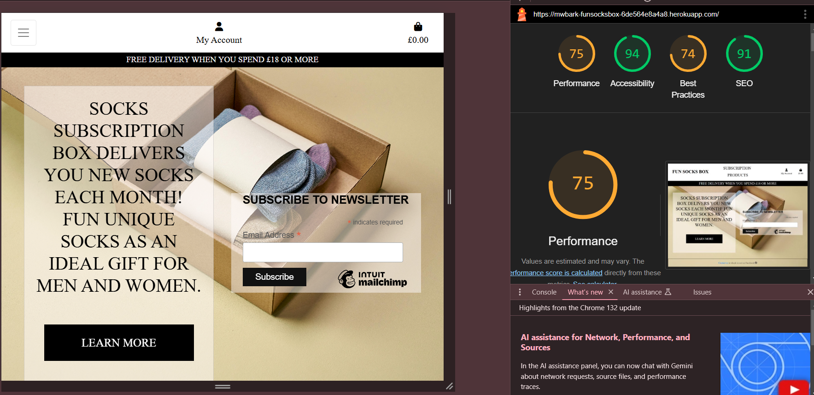

## Code Validation

### HTML

HTML code was tested using the [W3C Validator](https://validator.w3.org/) via URI.

### CSS

CSS code was tested using the [W3C CSS Validation Service](https://jigsaw.w3.org/css-validator/) via text input. 

### Javascript

Javascript code was tested using [JSHint](https://jshint.com/).

### Python

Python files were tested using the [CI Python Linter](https://pep8ci.herokuapp.com/)

### Lighthouse

The Performance and Best Practices could be improved. Changing the pic file size could improve perfomance. The bad performance comes from the cookies from Stripe and Inuit Mailchimp.

### Responsivness

All webpages are responsive with the [Boostrap grid](https://getbootstrap.com/docs/5.3/layout/grid/) layout. The breakpoints of col-sm, col-md and col-lg where used respectivley for mobile, tablet and laptop screens

### Browser Compatability

I have tested the website in Chrome, Firefox and Edge

**HOME**

### Manual Featrures Testing

List of all passed tests with FEATURE > ACTION > RESULT.

**NAVBAR**

- Navbar > mid to small screen size > Home, Subscription and Products link in burger icon dropdown
- Burger button > click > dropdown menu
- Business name home link > click > navigates to home page
- Subscription link > click >navigates to subscription page
- Products link > click > navigates to products page
- My Account > click > toggle dropdown menu
- Register in dropdown > click > navigates to sign up page
- Login in dropdown > click > nagigates to login page
- Address Book link in dropdown > click > navigates to specific user's Address book
- Manage subscription in dropdown > click > opens Stripe login in to manage page in new tab
- Logout in dropdown > click > navigates to logout page

**AUTHENTICATION**

- All allauth pages > navigates to > show relevent info and forms.
- forms > click submit with errors in forms > popover or red text ! symbol shown

Register

- Submit button > click > navigates to verify email page, sends email, shows alert

Confirm Email

- Confirm button > click > navigates to sign in page with success toast

Sign In

- Sign in button > click > signs in user, navigates to home page and success toast

**HOME**

- Home page > navigate to > shown subscription and newsletter divs
- Learn more button > click > navigates to subscription page
- Newsletter Subcribe > click > opens Intuit Mailchimp in new tab

**SUBSCRIPTION**

- Subscription page > navigate to > shows subscription info with register link if not logged in and sign up if logged in
- Register an Account > click > navigates to register page
- Sign up > click > opens Stripe subscription page in new tab

**PRODUCT**

- Products page > navigate to > shows product name and image in card
- Product card > click > navigates to relevant product page

if admin
- Add product > click > navigates to add product page
- Minus button > click > shows delete modal
- Delete modal confirm > click > deletes product, redirects to product page and success toast

**ADD PRODUCT**

- Add product page > navigate to > shows empty product form
- Add product button > click > adds product, navigates to related product detail and success toast.

**PRODUCT DETAIL**

- Product detail page > naigate to > shows all relevent images, info and buttons
- Product image > click > opens image in new tab
- Slideshow arrows > click > navigates to next and previous images
- Size dropdown > click > opens dropdown menu
- Size option > click > selects option
- Quantity + and - > click > adjust quantity
- Add to bag > click > adds specific product size and quantity to bag and info shown in success toast
- Keep shopping > click > navigates to products page

if admin
- Update product > click > navigates to update product page
- Manage Images > click > navigates to manage images page

**UPDATE PRODUCT**

- Update product page > navigate to > showns for with prefilled relevant info related to product
- Update product button> click > update product info, redirects to relevant product detail page and success toast

**MANAGE IMAGES**

- Manage images page > navigate to > shows related images to specific product in cards with - buttons and an Add Image button
- Add image button > click > shows add image modal
- Choose file > click > allows upload of local image file
- Add image button in modal > click > adds image, redirects back to manage images page with new image shown and success toast
- Minus button > click > shows delete image modal
- Delete button in Delete modal > click > deletes image, redirects back to update manage images page and success toast

**BAG**

- Bag page > navigate to > show all product info and pricing
- Plus and minus quantity buttons > click > alter quantity number
- Update > click > redirects to bag page with update quantity and updated success toast
- Remove > click > removes relevant product from bag, redirects to udated bag page with updated success toast
- Secure Checkout button > click > redirects to checkout page

**CHECKOUT**

- Checkout page > navigate to > shows form, with prefilled info if default address exists, order summary, Complete Order and Adjust Bag buttons, 'Create or change default address' if logged in or
- Complete order > click with incomplete or invalid info > popover prompt or redirects to same page with red card error message
- Complete order > click with valid info > redirects to checkout success page

**CHECKOUT SUCCESS**

- Checkout success > navigate to > shows all order, delivery and billing info, sends order conformation email which is confirmed in success toast

**ADDRESS BOOK**

- Address Book page > navigate to > shows all addresses linked to specific profile plus Add Address button
- Add Address button > click > navigates to Add address page
- Edit button > click > navigates to Update address page
- Minus button > click > shows delete modal
- Delete button in modal > click > deletes address and redirects to updated Address book page with success toast
- Set as Default > click > redirects to updated Address book page with success toast and 'DEFAULT' only show on selected address

**FOOTER**

- Cotact us link > click > navigates to Contact page

**CONTACT US**

- Contact Us page > navigate to > shows contact message form with required fields
- Send button > click > redirects to contact us page with empty form and success toast. Message saved in admin panel.

**404**

- Non existing page > enter in url > redirects to 404 page

**EDGE**

- Login required url > navigate to logged out > navigates to sign up page
- Admin only url action > navigate to without admin level permission > redirects to home page with error toast

